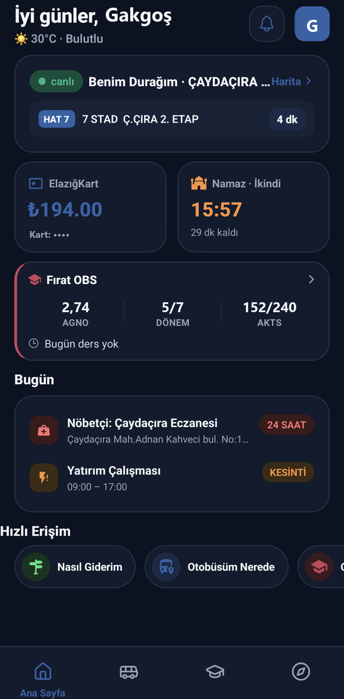
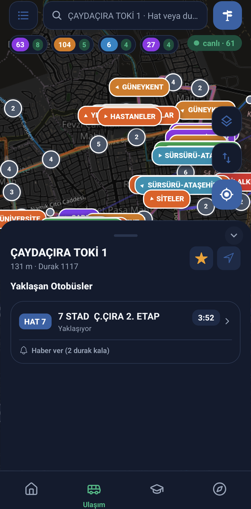
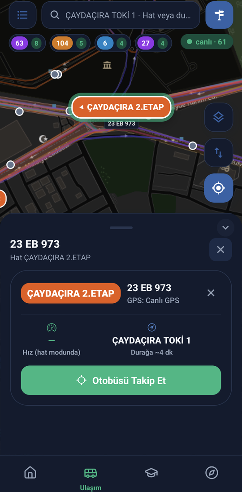
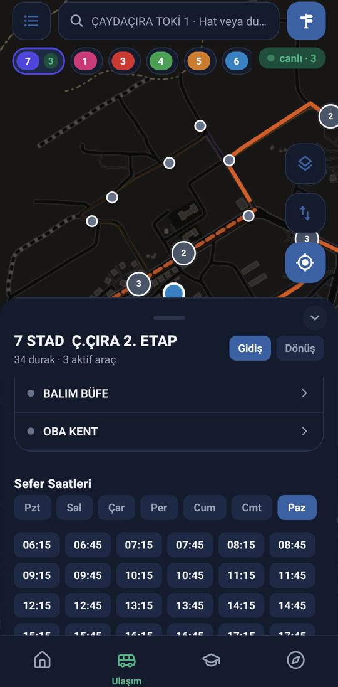
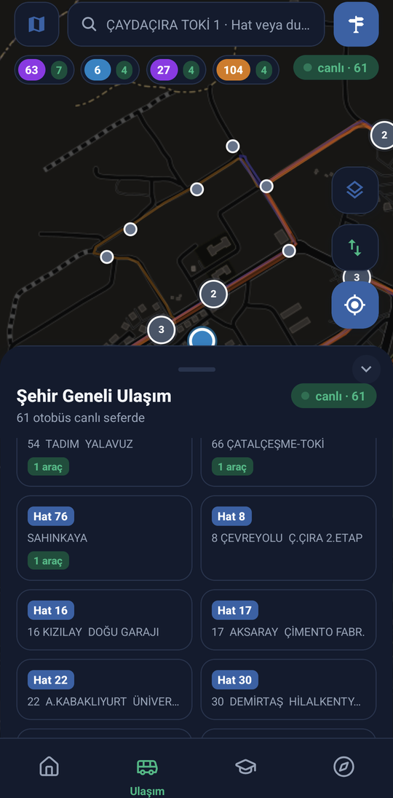
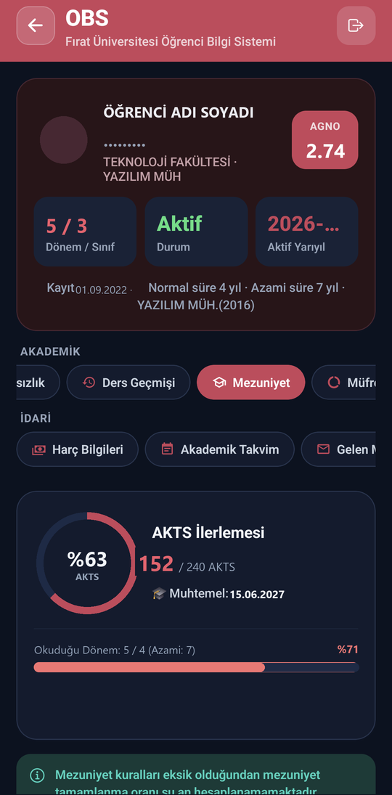
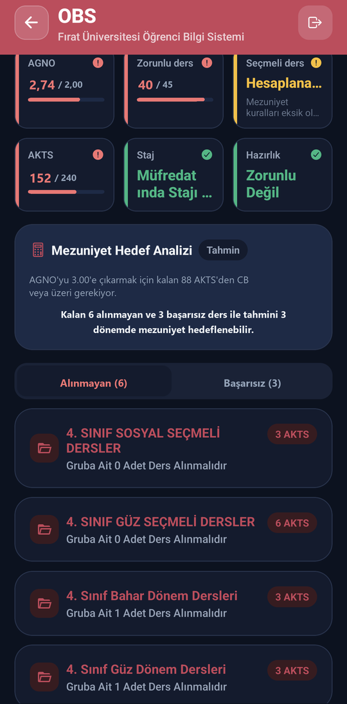
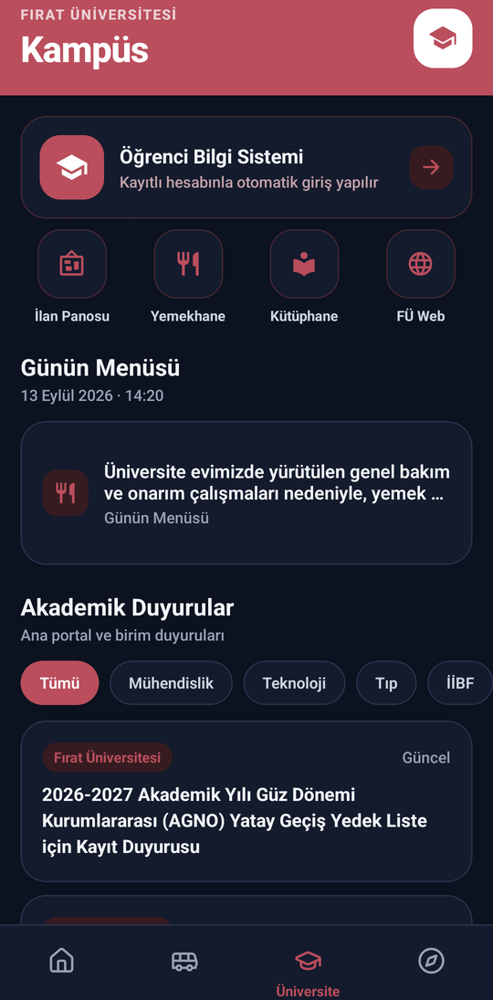

# Elazığ Şehir

<p align="center">
  
</p>

<p align="center">
  <strong>Elazığ için tek uygulamada gerçek zamanlı şehir hizmetleri ve Fırat Üniversitesi öğrenci ekosistemi.</strong>
</p>

<p align="center">
  
  
  
  
  
  
</p>

---

Elazığ Şehir; anlık belediye otobüs takibi ve ElazığKart yönetimi, Fırat Üniversitesi OBS entegrasyonu ve Mezuniyet Analizi, Bubilet etkinlikleri, güncel şehir haberleri, nöbetçi eczaneler ve planlı elektrik kesintilerini modern, akıcı ve tek bir çatı altında birleştiren açık kaynaklı bir mobil uygulamadır.

> [!IMPORTANT]  
> **%100 Canlı Veri Prensibi**: Uygulama **hiçbir örnek, sahte veya statik veri göstermez** — her ekran doğrudan ilgili kurum ve servislerin resmî API'lerinden gerçek zamanlı veri çeker.  
> *Bağımsız bir açık kaynak geliştirici projesidir; Elazığ Belediyesi, Fırat Üniversitesi veya Bubilet'in doğrudan resmî uygulaması değildir.*

---

## 📱 Ekran Görüntüleri

Tüm ekran görüntüleri gerçek Android cihaz üzerinden, canlı şehir verileriyle kaydedilmiştir *(kişisel öğrenci bilgileri, T.C. kimlik numaraları, kart numaraları maskelenmiş; akademik notlar örnek değerlerle temsil edilmiştir)*.

### 🚏 Canlı Ulaşım & Hat Haritası (Transit Engine v2)

| Ana Sayfa | Akıllı Durak & Yaklaşan Otobüsler | Canlı Araç Detay Kartı |
| :---: | :---: | :---: |
|  |  |  |
| *Canlı otobüsler, bakiye, OBS özeti, namaz ve kesintiler* | *Saniye bazlı canlı geri sayım ve durak mesafesi* | *Anlık hız (km/s), GPS tazeliği ve rota takip modu* |

<br />

| Hat Güzergahı & Seferler | Şehir Geneli Canlı Radar |
| :---: | :---: |
|  |  |
| *Gidiş/dönüş rotası, kalkış saatleri ve durak akış şeridi* | *Şehirdeki 50+ aktif aracın harita üzerinde eşzamanlı takibi* |

### 🎓 Fırat Üniversitesi OBS & Mezuniyet Durum Analizi

| Mezuniyet İlerleme Analizi | Mezuniyet Kriter Kartları | Kampüs & Üniversite |
| :---: | :---: | :---: |
|  |  |  |
| *AKTS ilerleme çubuğu, azami süre göstergesi ve eksik dersler* | *AGNO, zorunlu/seçmeli kredi, staj ve hedef AGNO simülatörü* | *Not listesi, çan eğrisi istatistikleri, haftalık program* |

---

## 🚀 Öne Çıkan Özellikler

### 🚌 1. Gelişmiş Canlı Ulaşım (Transit Engine v2)
- **Güzergah Üzerinde Manyetik Akıcı Hareket (Polyline Snapping & Interpolation)**: Ham GPS sinyalleri belediye hat geometrisine otomatik olarak izdüşürülür (`≤200 m`). Otobüsler koordinat zıplamaları yapmaz; kavşaklarda dönüşleri izleyerek, sabit 20 km/s şehir içi seyir hızına göre ara-değerlenerek akıcı bir şekilde süzülür.
- **Şehir Geneli Canlı Radar**: Tek dokunuşla şehirdeki tüm aktif hatları ve 50'den fazla hareket halindeki aracı 2-3 saniyede bir güncellenen canlı haritada izleme. Hat bazlı aktif araç filtreleme çipleri.
- **Akıllı Durak ve Geri Sayım**: Seçilen durağa yaklaşan otobüsler için saniye hassasiyetinde canlı geri sayım, durak mesafesi ve plaka gösterimi.
- **Canlı Araç Detay Paneli**: Haritadaki herhangi bir araca dokunulduğunda aracın anlık hızı (km/s), pusula yönü, GPS veri yaşı, sonraki durağa tahmini varış süresi ve kamerayla aracı takip modu.
- **"Haber Ver" Yerel Bildirimi**: Beklediğiniz otobüs durağınıza 2 durak kala sizi uyaran akıllı yerel bildirim sistemi.
- **Hat Detayları ve "Otobüs Şu An Burada" Şeridi**: 49 hattın gidiş/dönüş durak dizilimi, hareket saatleri, tarife ücretleri ve güzergah üzerindeki otobüslerin tam hangi duraklar arasında olduğunu gösteren canlı şerit.
- **"Binebileceğin En İyi Durak" Algoritması**: Kullanıcının yürüme süresi (5 km/s) ile otobüsün durağa varış süresini eşzamanlı hesaplayarak yetişebileceğiniz en ideal durağı önerir.
- **Rota Planlayıcı (Trip Planner)**: Başlangıç ve hedef durak/konum arasında aktarmasız veya 1 aktarmalı toplu taşıma alternatifleri.
- **ElazığKart & NFC Bakiye Sorgulama**: Kartı telefonun arkasına dokundurarak (NFC) veya kart numarasıyla anında bakiye, bekleyen yükleme ve son kullanım tarihi sorgulama.
- **Dolum Bayileri Haritası**: Konumunuza en yakın ElazığKart yükleme bayileri, çalışma bilgileri ve yol tarifi.

### 🎓 2. Fırat Üniversitesi OBS & Öğrenci Yaşamı
- **Güvenli Doğrudan CAS / SSO Girişi**: Fırat Üniversitesi resmî Jasig CAS protokolüyle oturum açma. Parolalar hiçbir harici sunucuya iletilmez, yalnızca cihazın donanımsal güvenli kasasında (`expo-secure-store`) saklanır.
- **Akademik Profil & AGNO**: Genel ağırlıklı not ortalaması, sınıf, danışman bilgileri ve kayıt durumu.
- **Notlar & Bağıl Değerlendirme İstatistikleri**: Vize, final, büt, quiz ve ödev puanları; sınıf ortalaması, harf notu frekans dağılım grafiği, standart sapma ve sınıf mevcudu.
- **Haftalık Ders Programı**: Günlük ve haftalık ders programı tablosu, yaklaşan ders kartı ve 6 saatlik akıllı offline önbellekleme.
- **🎓 Mezuniyet Durum Analizi (Graduation Audit Engine)**:
  - **AKTS İlerleme Çubuğu**: Tamamlanan, devam eden ve kalan AKTS oranları.
  - **Kriter Kartları**: AGNO barajı, zorunlu ders tamamlama, seçmeli ders kredileri, staj kabulü ve yabancı dil hazırlık şartı.
  - **Eksik & Başarısız Dersler Listesi**: Alınması gereken zorunlu ve tekrar edilen derslerin ayrıntılı dökümü.
  - **Hedef AGNO Simülatörü**: Mezuniyet hedefinize (ör. 3.00 veya 3.50) ulaşabilmeniz için kalan derslerden dönem başına kaç ortalama tutturmanız gerektiğini hesaplayan simülatör.
- **Kampüs Yemekhanesi**: Fırat Üniversitesi günlük öğle ve akşam yemek menüleri, kalori değerleri.
- **Duyurular & Akademik Takvim**: Rektörlük ve fakülte duyuruları, sınav ve kayıt haftaları takvimi.

### 🏛️ 3. Şehir Rehberi & Günlük Yaşam
- **Bubilet Etkinlikleri**: Elazığ'da düzenlenen konser, tiyatro, stand-up, çocuk etkinlikleri ve festivaller; kalan koltuk/bilet sayısı, seans saatleri, indirimler ve Süper Bilet fırsatları.
- **Nöbetçi Eczaneler**: Günün nöbetçi eczaneleri, nöbet saatleri, adresi, harita konumu ve tek tuşla doğrudan telefon araması.
- **Fırat EDAŞ Planlı Elektrik Kesintileri**: İlçe, mahalle ve sokak bazında planlanan elektrik kesintileri, başlama-bitiş saatleri ve çalışma gerekçeleri.
- **Elazığ Son Haber RSS**: Şehirdeki son dakika gelişmeleri, asayiş, ekonomi ve spor haberleri; kategori filtreleme ve paylaşım.
- **Diyanet Uyumlu Namaz Vakitleri**: Elazığ için günlük ezan vakitleri, sıradaki vakte kalan süre geri sayımı ve ezan vakti bildirimleri.
- **Hava Durumu**: Anlık sıcaklık, nem oranı, hissedilen sıcaklık ve hava durumu durumu.
- **Önemli Telefonlar**: Acil çağrı hatları, belediye birimleri ve hastane santralleri rehberi.

### 📢 4. Kampüs İlan Panosu & Topluluk
- **Firebase Firestore Altyapısı**: Fırat Üniversitesi öğrencileri için güvenli ev arkadaşı, ikinci el ders kitabı, eşya ve özel ders ilanları.
- **Hafif Görsel Sıkıştırma**: Mobil veri tüketimini azaltmak için cihaz tarafında otomatik optimize edilen ilan fotoğrafları (`expo-image-manipulator`).
- **Topluluk Güvenliği & Şikayet Sistemi**: Uygunsuz ilanlar için kullanıcı bildirim ve şikayet mekanizması (`reports/{ilanId_uid}`).

### 🤖 5. Gakgoş Asistan
- Canlı şehir ve üniversite verilerini (yaklaşan otobüsler, nöbetçi eczaneler, kesintiler, yemekhane menüsü) kullanarak doğal Türkçe ile hızlı cevap veren kural tabanlı yerel asistan.

### 📱 6. Android Native Widget Desteği (AppWidgets)
Kotlin ile yazılmış 3 adet optimize Android ana ekran bileşeni:
1. **Otobüs Yaklaşma Widget'ı** (`BusWidgetProvider`): Seçili favori durağa yaklaşan otobüsleri ana ekranda saniye bazlı gösterir.
2. **ElazığKart Bakiye Widget'ı** (`ElkartWidgetProvider`): Güncel kart bakiyesini ve son güncelleme zamanını yansıtır.
3. **Namaz Vakitleri Widget'ı** (`PrayerWidgetProvider`): Günün vakitlerini ve sıradaki ezana kalan süreyi ana ekrana taşır.

### 🎨 7. Tasarım Dili & Koyu Tema
- **Harput Kalesi Temalı Görsel Kimlik**: Şehrin kadim kalesi, doğan güneş ve ulaşım rotası çizgilerinden esinlenen modern vektörel ikon seti (`icon.png`, adaptive foreground, background, monochrome).
- **Gece Mavisi / Lacivert Palet**: `#0F2A4A` kurumsal açılış (splash) ve arayüz rengi.
- **Tam Koyu Tema (Dark Mode)**: Sistem temasına uyumlu veya manuel seçilebilir Koyu Tema desteği; CARTO Dark harita katmanı entegrasyonu.

---

## 🌐 Canlı Veri Kaynakları & Protokoller

| Servis | Sağlayıcı / Uç Nokta | Protokol / Format | Yenilenme Periyodu |
|---|---|---|---|
| **Canlı Otobüsler & Hatlar** | `elazigkart.elazig.bel.tr/api/wheremybus` | REST / GeoJSON | 2 – 5 saniye |
| **Durak Seferleri & Süre** | `elazigkart.elazig.bel.tr/api/smartstop` | REST / JSON | Anlık sorgu |
| **Kart Bakiyesi & Bayiler** | `elazigkart.elazig.bel.tr/api/card` | REST / JSON | İsteğe bağlı / NFC |
| **Öğrenci Bilgi Sistemi (OBS)** | `obs.firat.edu.tr` / `jasig.firat.edu.tr` | HTTPS CAS SSO / HTML Parse | Kullanıcı oturumu |
| **Yemekhane & Duyurular** | `unievi.firat.edu.tr` / `firat.edu.tr` | HTML / DOM Scraping | 6 saat önbellek |
| **Etkinlikler & Biletler** | `platform.api.bubilet.com.tr` | REST / JSON | 15 dakika önbellek |
| **Şehir Haberleri** | `elazigsonhaber.com/rss` | XML RSS | 10 dakika önbellek |
| **Nöbetçi Eczaneler** | `elazig.bel.tr` | REST / JSON | Günlük |
| **Elektrik Kesintileri** | `firatedas.com.tr` | REST / JSON | Günlük |
| **Namaz Vakitleri** | Aladhan API (Diyanet İşleri Başkanlığı metodu) | REST / JSON | 24 saat önbellek |
| **Hava Durumu** | WeatherAPI | REST / JSON | 30 dakika önbellek |

---

## 🛠️ Teknoloji Yığını

- **Çekirdek**: [React Native](https://reactnative.dev/) 0.81, [Expo](https://expo.dev/) SDK 54, [TypeScript](https://www.typescriptlang.org/) 5.3
- **Yönlendirme (Navigation)**: [Expo Router v6](https://docs.expo.dev/router/introduction/) (File-based routing)
- **Harita & Harita Katmanı**: Leaflet 1.9 + React Native WebView (CARTO Positron & CARTO Dark tile'ları)
- **Kullanıcı Arayüzü**: Özel Tasarım Sistemi (`components/ui.tsx`), Lucide React Native ikon seti
- **Yerel Güvenlik**: `expo-secure-store` (AES-256 donanımsal anahtarlık)
- **Donanım Entegrasyonu**: `react-native-nfc-manager` (ElazığKart NFC okuyucu)
- **Native Android Widget'ları**: Kotlin + RemoteViews (`native-widgets/`, Expo Config Plugin)
- **Veritabanı & Kimlik**: Firebase Authentication + Cloud Firestore

---

## 💻 Kurulum ve Yerel Geliştirme

### Gereksinimler
- [Node.js](https://nodejs.org/) (v18 veya v20 LTS önerilir)
- [npm](https://www.npmjs.com/) veya [yarn](https://yarnpkg.com/)
- [Android Studio](https://developer.android.com/studio) ve Android SDK (cihazda/emülatörde yerel derleme için)
- [Expo Go](https://expo.dev/go) veya EAS Development Build

### Adım Adım Kurulum

```bash
# 1. Depoyu klonlayın
git clone https://github.com/crowroser/elazigapp.git
cd elazigapp

# 2. Bağımlılıkları yükleyin
npm install

# 3. Çevre değişkenlerini yapılandırın
cp .env.example .env

# 4. Firebase Android yapılandırmasını ekleyin (gerekiyorsa)
cp google-services.json.example google-services.json

# 5. Geliştirme sunucusunu başlatın
npx expo start
```

### Çevre Değişkenleri (`.env`)

| Değişken | Açıklama |
|---|---|
| `EXPO_PUBLIC_FIREBASE_API_KEY` | Firebase Web API anahtarı |
| `EXPO_PUBLIC_FIREBASE_AUTH_DOMAIN` | Firebase Authentication domain |
| `EXPO_PUBLIC_FIREBASE_PROJECT_ID` | Firebase proje kimliği (`elazig-sehir`) |
| `EXPO_PUBLIC_FIREBASE_STORAGE_BUCKET` | Firebase Cloud Storage bucket adı |
| `EXPO_PUBLIC_FIREBASE_MESSAGING_SENDER_ID`| Firebase Cloud Messaging gönderici no |
| `EXPO_PUBLIC_FIREBASE_APP_ID` | Firebase mobil/web uygulama kimliği |
| `EXPO_PUBLIC_GOOGLE_WEB_CLIENT_ID` | Google Sign-In istemci kimliği |
| `EXPO_PUBLIC_WEATHER_API_KEY` | WeatherAPI servis anahtarı |

> [!NOTE]  
> `.env` dosyası, `google-services.json` ve keystore dosyaları `.gitignore` ile korunur. Depoya gizli anahtarlar yüklenmez.

---

## 📦 EAS Build (Android Üretim APK'sı Alma)

Uygulama, Expo Application Services (EAS) bulut altyapısı kullanılarak bağımsız Android APK paketi olarak derlenir.

### Yapılandırma (`eas.json`)
```json
{
  "cli": {
    "appVersionSource": "remote"
  },
  "build": {
    "production": {
      "autoIncrement": true,
      "android": {
        "buildType": "apk"
      }
    }
  }
}
```

### Derleme Komutu

Bulut üzerinde doğrudan APK üretmek için:

```bash
eas build -p android --profile production
```

- EAS, uzak sürüm kodunu (`versionCode`) otomatik artırır (`autoIncrement: true`).
- `app.config.js`, EAS ortamındaki `GOOGLE_SERVICES_JSON_BASE64` veya `GOOGLE_SERVICES_JSON` değişkeninden `google-services.json` dosyasını otomatik üretir.
- Derleme bittiğinde verilen indirme bağlantısından `.apk` dosyası elde edilir.

---

## 📂 Proje Dizin Yapısı

```text
elazigapp/
├── app/                              # Expo Router ekran ve sekme yönlendirmeleri
│   ├── (tabs)/                       # Alt sekme çubuğu ekranları
│   │   ├── index.tsx                 # Ana Sayfa (Tek panel özet, canlı durak, namaz, OBS)
│   │   ├── transit.tsx               # Ulaşım & Canlı Hat Haritası (Transit Engine v2)
│   │   ├── university.tsx            # Kampüs & Üniversite (Notlar, program, yemekhane)
│   │   └── services.tsx              # Şehir Hizmetleri (Etkinlik, haber, eczane, kesinti)
│   ├── obs.tsx                       # Fırat OBS detay & Mezuniyet Analiz ekranı
│   ├── classifieds.tsx               # Kampüs İlan Panosu
│   ├── assistant.tsx                 # Gakgoş Asistan sohbet arayüzü
│   ├── trip_planner.tsx              # Rota Planlayıcı
│   ├── fillingcenters.tsx            # ElazığKart Dolum Bayileri harita listesi
│   ├── notifications.tsx             # Akıllı bildirim ayarları
│   └── widgets.tsx                   # Android Widget yapılandırma ve önizleme
├── components/                       # Yeniden kullanılabilir UI ve harita bileşenleri
│   ├── ui.tsx                        # Tasarım sistemi (Card, Chip, Button, StatTile, Modal)
│   ├── LeafletMap.tsx                # Harita motoru (Animasyonlu araçlar, polyline snap)
│   └── PrayerCard.tsx                # Namaz vakti kartı ve geri sayım
├── constants/                        # Tema ve stil sabitleri
│   └── Theme.ts                      # Renk paleti, tipografi, boşluklar, Açık/Koyu tema
├── services/                         # Servis ve veri katmanı
│   ├── apiService.ts                 # ElazığKart API, eczaneler, kesintiler, haberler
│   ├── obsService.ts                 # Fırat OBS CAS girişi, HTML parsers, mezuniyet motoru
│   ├── eventsService.ts              # Bubilet API etkinlik istemcisi
│   ├── authService.ts                # Firebase Auth & Firestore profil yönetimi
│   ├── notificationService.ts        # Yerel bildirim planlayıcı
│   ├── widgetService.ts              # Native widget veri köprüsü
│   └── prefsService.ts               # AsyncStorage yerel kullanıcı tercihleri
├── native-widgets/                   # Yerel Android AppWidget Kotlin kodları ve XML layout'ları
├── plugins/                          # Expo Config Plugins (withElazigWidgets)
├── docs/                             # Dokümantasyon ve ekran görüntüleri
│   └── screenshots/                  # Yüksek çözünürlüklü uygulama ekran görüntüleri
├── app.config.js                     # Dinamik Expo uygulama yapılandırması
├── eas.json                          # EAS Build profilleri
└── package.json                      # Proje bağımlılıkları ve betikleri
```

---

## 🔐 Güvenlik ve Gizlilik

- **Öğrenci Şifre Güvenliği**: Fırat OBS öğrenci numarası ve şifresi kesinlikle harici bir sunucuya, üçüncü taraf servise veya analitik platformuna gönderilmez. Doğrudan üniversitenin HTTPS CAS uç noktasıyla el sıkışılır. Şifreler cihaz üzerinde donanımsal şifreleme (`expo-secure-store`) ile tutulur.
- **İlan Güvenliği**: Firestore güvenlik kuralları (`firestore.rules`) gereği kullanıcılar yalnızca kendi ilanlarını düzenleyebilir veya silebilir. Şikayet edilen içerikler anında işaretlenir.
- **Kart Bilgileri**: ElazığKart NFC sorguları yalnızca bakiye ve son hareketleri okur; kişisel banka veya kredi kartı bilgisi barındırmaz.

---

## 📄 Lisans

Bu proje [MIT Lisansı](LICENSE) altında geliştirilmektedir ve açık kaynaklıdır.

---

<p align="center">
  Gakgoşlar diyarı Elazığ için sevgiyle geliştirildi. ❤️
</p>
